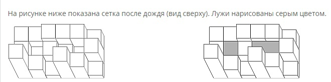
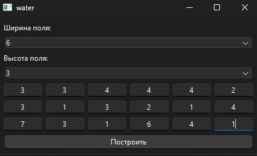
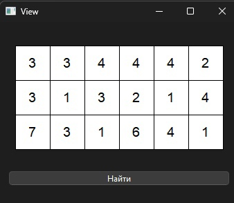
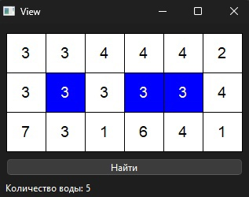
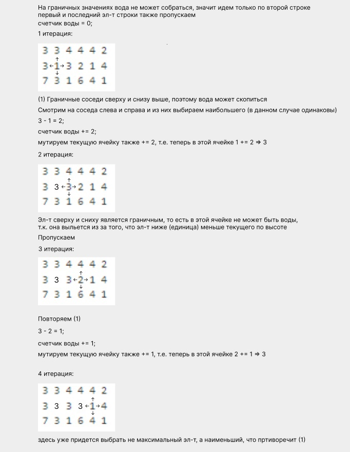

## Spoj - WATER - Water among Cubes

Постановка задачи: https://www.spoj.com/problems/WATER/

Тезисно: есть поле n * m, состоящее из кубов, каждый куб занимает ровно одну ячейку и единственное отличие кубов - это высота.

Поле - это крыша.

Задача: определить какое количество воды может скопиться на крыше после дождя



### Первое окно (mainwindow) с UI для ввода данных



### Второе окно с отображением на плоскости, цифра эл-та его высота



### Итоговое окно с отображением решения 



### Алгоритм с исп-ем очереди с приоритетом

Идея исп-ть очередь с приоритетом взята (https://www.quora.com/How-do-I-solve-the-problem-Water-among-cubes-WATER-on-SPOJ)

Идея исп-ть направления отсюда (https://github.com/xamitksx/SPOJ/blob/master/WATER%20(Water%20among%20Cubes).cpp)

Изначальный подход с простым перебором всех вершин не покрывает все тест кейсы и в некоторых случаях не рабоает (не поулчается обобщить)



Итоговый алгортим использует очередь с приоритетом (в порядке возрастания).

1) Проходимся по всем границам и добавляем в очередь;
2) В цикле до тех пор пока очередь не пуста извлекаем верхний эл-т, который всегда будет минимальным;
3) С помощью вектора dir просматриваем соседей и если высота текущей клетки больше высоты соседней клетки, значит можно захватить воду;
4) Добавляем соседнюю клетку в очередь с высотой равной максимуму между её собственной высотой и высотой текущей клетки и продолжаем алгоритм до тех пор, пока очередь не пуста

```c++
class Solution {
public:
    // Структура клетки, у нее есть высота, коор-ты по x и y, и уровень воды
    struct Cell {
        int height;
        int x;
        int y;
        int waterLevel;
        Cell(int h, int x, int y, int w = 0) : height(h), x(x), y(y), waterLevel(w) {}
    };

    // Компаратор, будет сортировать в порядке возрастания
    struct Compare {
        bool operator()(const Cell& a, const Cell& b) {
            return a.height > b.height;
        }
    };

    // Метод, принимающий двумерный вектор, иллюстрирующий поле H * W
    // вернем пару из итогового кол-ва воды и затопленных ячеек
    std::pair<int, QVector<Cell>> trapRainWater(const QVector<QVector<int>>& heightMap) {
        if (heightMap.isEmpty() || heightMap[0].isEmpty()) return {0, QVector<Cell>()};

        int H = heightMap.size();
        int W = heightMap[0].size();

        // Используем очередь с приоритетом и передаем ф-цию компаратор, без него по дефолту сортирует в порядке убывания
        std::priority_queue<Cell, std::vector<Cell>, Compare> minHeap;
        // Вектор для отслеживания посещенных вершин
        QVector<QVector<bool>> visited(H, QVector<bool>(W, false));
        // Вектор для хранения ячеек с водой
        QVector<Cell> waterCells;

        // Добавляем все элементы границы в очередь
        // первый параметр - сама высота клетки, второй и третий параметр - координаты по x, y
        for (int i = 0; i < H; ++i) {
            minHeap.push(Cell(heightMap[i][0], i, 0)); // левая граница
            visited[i][0] = true;
            minHeap.push(Cell(heightMap[i][W - 1], i, W - 1)); // правая граница
            visited[i][W - 1] = true;
        }

        for (int j = 1; j < W - 1; ++j) {
            minHeap.push(Cell(heightMap[0][j], 0, j)); // верхняя граница
            visited[0][j] = true;
            minHeap.push(Cell(heightMap[H - 1][j], H - 1, j)); // нижняя граница
            visited[H - 1][j] = true;
        }

        // Направления для перемещения по соседним клеткам, т.к. сравнивать будем с соседями сверху, снизу, справа и слева
        QVector<int> dir = { -1, 0, 1, 0, -1 };
        // Счетчик
        int waterTrapped = 0;

        while (!minHeap.empty()) {
            // Извлекаем верхний (min) эл-т и удаляем из очереди
            Cell cell = minHeap.top();
            minHeap.pop();

            for (int k = 0; k < 4; ++k) {
                int x = cell.x + dir[k];
                int y = cell.y + dir[k + 1];

                if (x >= 0 && x < H && y >= 0 && y < W && !visited[x][y]) {
                    // Если высота текущей клетки больше высоты соседней клетки, значит можно захватить воду
                    int trappedWater = std::max(0, cell.height - heightMap[x][y]);
                    waterTrapped += trappedWater;

                    // Если добавили воду, значит ячейка "затоплена"
                    if (trappedWater > 0) {
                        waterCells.append(Cell(heightMap[x][y], x, y, cell.height));
                    }

                    // Добавляем соседнюю клетку в очередь с высотой равной максимуму между её собственной высотой и высотой текущей клетки
                    minHeap.push(Cell(std::max(heightMap[x][y], cell.height), x, y));
                    visited[x][y] = true;
                }
            }
        }

        return {waterTrapped, waterCells};
    }
};
```