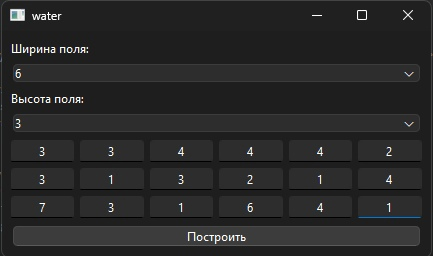
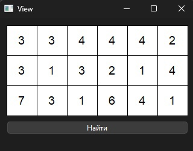

## Spoj - WATER - Water among Cubes

Постановка задачи: https://www.spoj.com/problems/WATER/

Тезисно: есть поле n * m, состоящее из кубов, каждый куб занимает ровно одну ячейку и единственное отличие кубов - это высота.

Поле - это крыша.

Задача: определить какое количество воды может скопиться на крыше после дождя


### Первое окно (mainwindow) с UI для ввода данных



### Второе окно с отображением на плоскости, цифра эл-та его высота



### Итоговое окно с отображением решения 


### Алгоритм с исп-ем очереди с приоритетом

Идея исп-ть очередь с приоритетом взята (https://www.quora.com/How-do-I-solve-the-problem-Water-among-cubes-WATER-on-SPOJ)

Идея исп-ть направления отсюда (https://github.com/xamitksx/SPOJ/blob/master/WATER%20(Water%20among%20Cubes).cpp)

Изначальный подход с простым перебором всех вершин не покрывает все тест кейсы и в некоторых случаях не рабоает (не поулчается обобщить)


```c++
class Solution {
public:
    struct Cell {
        int height;
        int x;
        int y;
        Cell(int h, int x, int y) : height(h), x(x), y(y) {}
    };

    struct compare {
        bool operator()(const Cell& a, const Cell& b) {
            return a.height > b.height;
        }
    };

    int trapRainWater(vector<vector<int>>& heightMap) {
        if (heightMap.empty() || heightMap[0].empty()) return 0;

        int H = heightMap.size();
        int W = heightMap[0].size();

        priority_queue<Cell, vector<Cell>, compare> minHeap;
        vector<vector<bool>> visited(H, vector<bool>(W, false));

        // Добавляем все элементы границы в Min-Heap
        for (int i = 0; i < H; ++i) {
            minHeap.push(Cell(heightMap[i][0], i, 0));
            visited[i][0] = true;
            minHeap.push(Cell(heightMap[i][W - 1], i, W - 1));
            visited[i][W - 1] = true;
        }

        for (int j = 1; j < W - 1; ++j) {
            minHeap.push(Cell(heightMap[0][j], 0, j));
            visited[0][j] = true;
            minHeap.push(Cell(heightMap[H - 1][j], H - 1, j));
            visited[H - 1][j] = true;
        }

        // Направления для перемещения по соседним клеткам
        vector<int> dir = { -1, 0, 1, 0, -1 };
        int waterTrapped = 0;

        // Алгоритм поиска с приоритетной очередью
        while (!minHeap.empty()) {
            Cell cell = minHeap.top();
            minHeap.pop();

            for (int k = 0; k < 4; ++k) {
                int x = cell.x + dir[k];
                int y = cell.y + dir[k + 1];

                if (x >= 0 && x < H && y >= 0 && y < W && !visited[x][y]) {
                    waterTrapped += max(0, cell.height - heightMap[x][y]);
                    minHeap.push(Cell(max(heightMap[x][y], cell.height), x, y));
                    visited[x][y] = true;
                }
            }
        }

        return waterTrapped;
    }
};
```